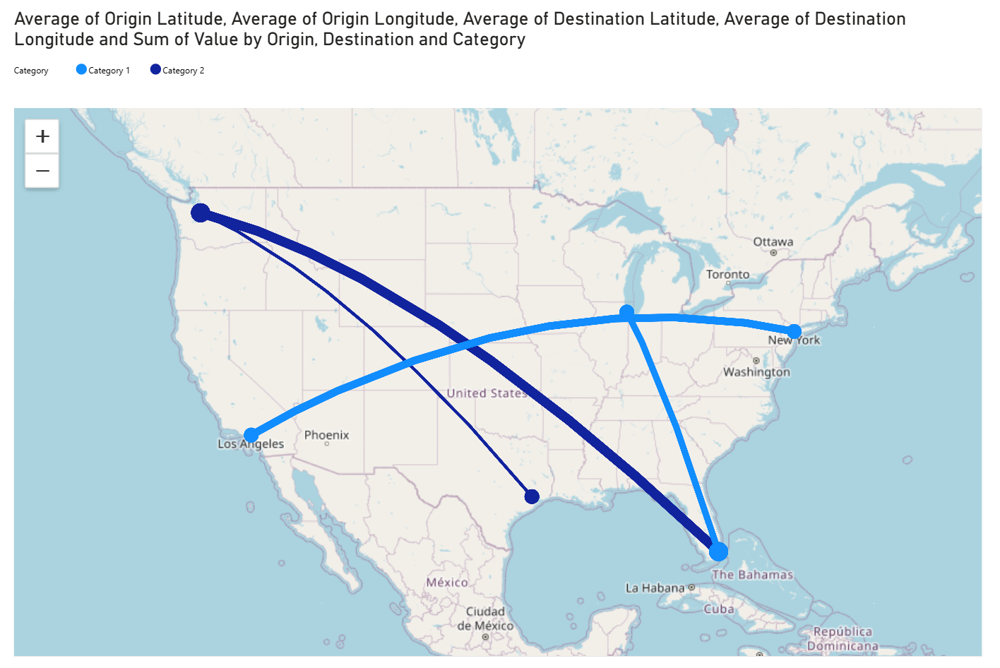

# Route Map – Power BI Custom Visual


**Route Map** is a custom visual for Power BI that displays origin–destination routes on an interactive map. It's ideal for visualizing logistics, shipments, people flows, or any movement between locations.



---

## ✨ Features

- 🗺️ Draws curved or straight-line routes between origin and destination points
- 📍 Interactive selection & cross-highlighting support
- 🧠 Dynamic scaling of route width and bubble size
- 🌍 Uses OpenStreetMap (free) or Azure Maps (enterprise)
- 🧭 High-contrast and accessibility support
- 🌐 Fully localized formatting pane (en-US, sv-SE)
- 🧰 Supports native Power BI tooltips

---

## ⚠️ Licensing Notice

This free version of Route Map uses **OpenStreetMap**, which is not recommended for enterprise environments due to licensing and service-level constraints.

If you're deploying this visual in a commercial or production setting, we highly recommend using the **Azure Maps–powered enterprise version**, which includes:

- Microsoft-backed SLA and terms
- Enhanced performance and reliability
- No attribution or usage limitations

📩 **Contact**: For licensing or purchasing the enterprise version with Azure Maps support, email **contact@lytiqa.se**

---

## 📦 Installation

Install from the official **Microsoft AppSource** or load manually:

1. In Power BI Desktop, go to `... > Get more visuals`
2. Search for **Route Map**  
3. Click **Add**

> Or download the `.pbiviz` file from [Releases](https://github.com/Lytiqa/PowerBI-visuals-Route-Map/releases) and import manually.

---

## 🧪 Sample

You can find a demo `.pbit` template file in the [`/sample`](./sample) folder that shows how to use the visual with fields like:

- **Origin Latitude**
- **Origin Longitude**
- **Destination Latitude**
- **Destination Longitude**
- **Line Width** (optional measure)
- **Category** (for color/legend)
- **Tooltips**

---

## 🛠️ Development

To build or modify the visual:

```powershell
npm install -g powerbi-visuals-tools
npm install
pbiviz start
```

To package and validate:

```powershell
pbiviz package
pbiviz validate
```

---

## 📁 Project Structure

```
src/                → TypeScript source code
assets/             → Icons and screenshots
sample/             → Example .pbit file
pbiviz.json         → Visual configuration
capabilities.json   → Field mappings
resources/          → Localization files
```

---

## 📄 License

MIT License – see [LICENSE](./LICENSE)

---

## 📬 Contact & Support

Created by [Lytiqa](https://github.com/Lytiqa).  
For enterprise licensing with Azure Maps, email **contact@lytiqa.se**  
Questions or bugs? [Open an issue](https://github.com/Lytiqa/PowerBI-visuals-Route-Map/issues).
